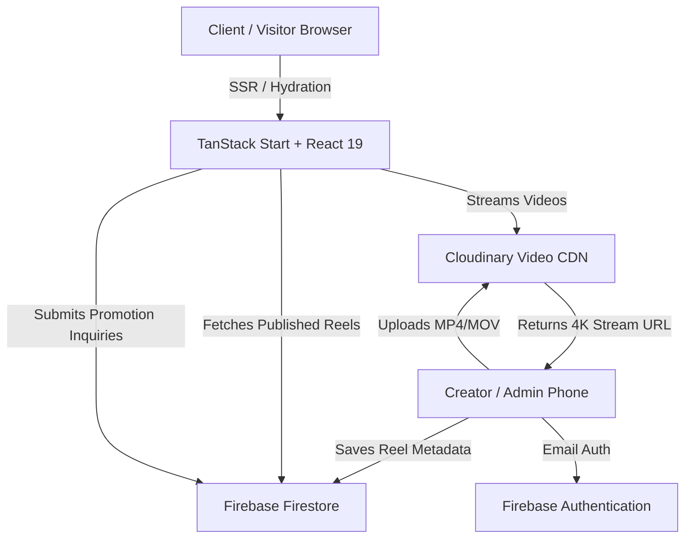

# 🎬 Commercial Creator & Brand Promoter Portfolio Blueprint
### *The Complete Master Guide for Building, Customizing & Deploying High-Converting Creator Portfolio Websites for New Clients*

> **Created by:** [KyvraOne](https://instagram.com/kyvraone)  
> **Architecture:** Modern SSR / Jamstack with TanStack Start, React 19, Tailwind CSS v4, Firebase Firestore & Cloudinary.

---

## 📑 Table of Contents
1. [Project Overview & Value Proposition](#1-project-overview--value-proposition)
2. [Tech Stack & System Architecture](#2-tech-stack--system-architecture)
3. [Third-Party Cloud Services Setup](#3-third-party-cloud-services-setup)
   - [Firebase Setup (Firestore & Auth)](#a-firebase-setup)
   - [Cloudinary Setup (Direct Video Hosting)](#b-cloudinary-setup)
4. [Step-by-Step New Client Setup Guide](#4-step-by-step-new-client-setup-guide)
5. [Client Customization Checklist (Search & Replace)](#5-client-customization-checklist)
6. [Database Schema & Security Rules](#6-database-schema--security-rules)
7. [Component & Feature Blueprint](#7-component--feature-blueprint)
8. [Admin Panel & Workflow](#8-admin-panel--workflow)
9. [Build, Verification & Deployment (Netlify/Vercel)](#9-build-verification--deployment)
10. [Troubleshooting & Best Practices](#10-troubleshooting--best-practices)

---

## 1. Project Overview & Value Proposition

This codebase is a specialized, high-converting digital portfolio built for:
- **Influencers & Creators** doing paid store promotions & brand collaborations.
- **Videographers & Studios** offering commercial reels, cafe tours, and product drops.
- **Local Business Marketers** helping retail stores, showrooms, and gyms drive walk-in footfall.

### Core Differentiators
- **Vertical-First Media Engine:** Simulates real mobile phone / Instagram reels with auto-looping 9:16 videos, double-tap floating hearts, tap-to-unmute, view counts, and store tags.
- **No Heavy Backend Required:** Fully serverless architecture using Firebase Firestore for data and Cloudinary for high-speed video streaming.
- **Integrated Admin Suite:** The client can log in from any phone or computer, upload a reel directly from their camera roll, set view counts, reorder reels, and view incoming business inquiries.
- **Immediate Lead Capture:** Contact submissions go straight to Firestore and WhatsApp with pre-filled commercial collaboration messages.

---

## 2. Tech Stack & System Architecture



| Layer | Technology | Purpose |
| :--- | :--- | :--- |
| **Framework** | [TanStack Start](https://tanstack.com/start) + React 19 | Full-stack SSR with instant routing and hydration |
| **Styling** | Tailwind CSS v4 (`@tailwindcss/vite`) | Ultra-fast styling with dark luxury aesthetic |
| **Animations** | Framer Motion 12 | Smooth kinetic typography, modals, and heart bursts |
| **Icons** | Lucide React | Clean, scalable UI icons |
| **Database** | Firebase Firestore | Real-time NoSQL store for reels & client leads |
| **Auth** | Firebase Auth | Secure email/password login for creator dashboard |
| **Video Storage**| Cloudinary | Fast global video CDN with auto-transcoding |
| **Hosting** | Netlify (Preset: Nitro) / Vercel / Node | Serverless edge deployment with continuous Git CI/CD |

---

## 3. Third-Party Cloud Services Setup

When onboarding a new client, you will set up two free-tier cloud accounts (or reuse an agency master account):

### A. Firebase Setup
1. Go to [Firebase Console](https://console.firebase.google.com/) and click **Add project**.
2. **Project name:** `clientname-portfolio` (e.g. `desai-siddhraj-portfolio`). Disable Google Analytics if not needed.
3. **Authentication:**
   - In the left sidebar, click **Build > Authentication > Get Started**.
   - Under Sign-in method, enable **Email/Password**.
   - Go to **Users** tab and click **Add user**. Enter the client's admin email and a strong password.
4. **Firestore Database:**
   - Click **Build > Firestore Database > Create Database**.
   - Choose a region close to your client's target audience (e.g. `asia-south1` for India).
   - Start in **Test mode** (or apply production rules from Section 6).
5. **Get Config Keys:**
   - Go to **Project Settings** (gear icon) > **General**.
   - Scroll down to "Your apps", click the **Web (`</>`)** icon, and register the app.
   - Copy the `firebaseConfig` object to paste into `src/lib/firebase.ts`.

---

### B. Cloudinary Setup
1. Sign up or log into [Cloudinary](https://cloudinary.com/).
2. From the Dashboard, copy:
   - **Cloud Name** (e.g. `aq0tldut`)
   - **API Key** (e.g. `179994451972317`)
   - **API Secret** (e.g. `EL1senqfqEdZbjFEYbDFx9cc1uw`)
3. Under **Settings > Upload**, ensure media uploads are allowed for videos.

---

## 4. Step-by-Step New Client Setup Guide

### Step 1: Clone Repository
```bash
git clone https://github.com/BIPINRVANJARA/dreemreel.git client-portfolio
cd client-portfolio
npm install
```

### Step 2: Configure Firebase
Open [`src/lib/firebase.ts`](file:///src/lib/firebase.ts) and replace the config keys:
```typescript
export const firebaseConfig = {
  apiKey: "YOUR_FIREBASE_API_KEY",
  authDomain: "your-project-id.firebaseapp.com",
  projectId: "your-project-id",
  storageBucket: "your-project-id.firebasestorage.app",
  messagingSenderId: "YOUR_SENDER_ID",
  appId: "YOUR_APP_ID",
  measurementId: "YOUR_MEASUREMENT_ID" // optional
};
```

### Step 3: Configure Cloudinary in Admin Panel
Open [`src/routes/_authenticated/admin.tsx`](file:///src/routes/_authenticated/admin.tsx) and update `uploadToCloudinary`:
```typescript
const cloudName = "YOUR_CLOUDINARY_CLOUD_NAME";
const apiKey = "YOUR_CLOUDINARY_API_KEY";
const apiSecret = "YOUR_CLOUDINARY_API_SECRET";
const folder = "client_reels";
```

### Step 4: Add Client Photos & Assets
Place the client's high-resolution images in the `/public/images/` directory:
- `public/images/siddhraj-hero.jpg` $\rightarrow$ Wide cinematic background for the Hero section.
- `public/images/siddhraj-portrait.jpg` $\rightarrow$ Editorial vertical portrait for the "Meet Creator" section.
- `public/favicon.ico` $\rightarrow$ Client brand favicon or monogram.

### Step 5: Test Locally
```bash
npm run dev
```
Visit `http://localhost:8080/` to test public pages and `http://localhost:8080/auth` to test admin login.

---

## 5. Client Customization Checklist

Perform a global find-and-replace or update these specific files to rebrand the entire site for the new client:

### 1. Brand Name & Taglines
| Setting | Recommended Value / Client Target | Key Files |
| :--- | :--- | :--- |
| **Creator Name** | E.g. *"Desai Siddhraj"* | `nav.tsx`, `hero.tsx`, `footer.tsx`, `about-siddhraj.tsx`, `__root.tsx` |
| **Tagline / Headline** | *"I don't just promote your business. I make people want to visit it."* | `hero.tsx`, `reels-showcase.tsx` |
| **Location / Region** | E.g. *"Mehtapura, Himmatnagar, Gujarat"* | `hero.tsx`, `about-siddhraj.tsx`, `contact.tsx`, `footer.tsx` |
| **Monogram / Logo** | E.g. `"DS"` in `nav.tsx` and `footer.tsx` | `nav.tsx`, `footer.tsx` |

### 2. Social & Contact Details
- **WhatsApp Phone Number:** Change `+91 90163 53934` to the client's number in:
  - `src/components/site/nav.tsx`
  - `src/components/site/hero.tsx`
  - `src/components/site/about-siddhraj.tsx`
  - `src/components/site/contact.tsx`
  - `src/components/site/footer.tsx`
  - `src/components/site/floating-actions.tsx`
- **Instagram Handle:** Change `@desaii_sidhdhraj` to the client's profile in:
  - `src/components/site/about-siddhraj.tsx`
  - `src/components/site/contact.tsx`
  - `src/components/site/footer.tsx`
  - `src/components/site/floating-actions.tsx`
- **Agency / Developer Credit:**
  - Update `src/components/site/footer.tsx`:
    `Made by IG @kyvraone • © All rights reserved by kyvraone`

### 3. Business Promotion Verticals
In [`src/lib/mock.ts`](file:///src/lib/mock.ts), you can customize or extend categories:
```typescript
export type ReelCategory =
  | "store_launch"        // Store Openings & Launches
  | "fashion_clothing"    // Fashion & Clothing
  | "food_cafes"          // Cafes, Restaurants & Food
  | "electronics_mobile"  // Mobile Stores & Gadgets
  | "jewellery_watches"   // Jewellery & Luxury
  | "fitness_gym"         // Gyms & Fitness Clubs
  | "automotive"          // Auto & Showrooms
  | "business_promo"      // Local Businesses & Services
  | "other";              // Special Drops
```

---

## 6. Database Schema & Security Rules

### Firestore Collections

#### 1. `reels` Collection
Each document represents a published or draft promotional reel:
```json
{
  "id": "auto-generated-doc-id",
  "title": "Signature Cold Coffee & Cafe Tour",
  "category": "food_cafes",
  "store_name": "Royal Roast Cafe",
  "collection_name": "Grand Opening '26",
  "views_count": "38.5K",
  "location": "Himmatnagar, Gujarat",
  "video_url": "https://res.cloudinary.com/demo/video/upload/v1234/sample.mp4",
  "thumbnail_url": null,
  "duration_seconds": 30,
  "featured": true,
  "published": true,
  "sort_order": 1
}
```

#### 2. `leads` Collection
Captures incoming commercial requests from business owners:
```json
{
  "name": "Shreeji Jewellers",
  "phone": "+91 98765 43210",
  "event_type": "Store Grand Opening & Launch",
  "event_date": "2026-10-15",
  "message": "We are opening our new diamond showroom and need 3 promotional reels.",
  "source": "website_promotion_inquiry",
  "created_at": "2026-09-05T08:30:00.000Z"
}
```

### Firestore Security Rules
Go to **Firestore Database > Rules** in Firebase Console and paste:
```javascript
rules_version = '2';
service cloud.firestore {
  match /databases/{database}/documents {
    
    // Anyone can read published reels
    match /reels/{reelId} {
      allow read: if true;
      allow write: if request.auth != null; // Only logged-in admin can add/edit/delete
    }

    // Public visitors can submit promotion inquiries (leads)
    match /leads/{leadId} {
      allow create: if true;
      allow read, update, delete: if request.auth != null; // Only admin can view leads
    }
  }
}
```

---

## 7. Component & Feature Blueprint

```
src/
├── components/
│   └── site/
│       ├── nav.tsx                  # Fixed blur header with branding, anchor links, and CTA
│       ├── hero.tsx                 # Cinematic portrait backdrop, kinetic ticker, and primary CTAs
│       ├── reels-showcase.tsx       # Snap-scroll interactive phone cards (autoplay, sound, hearts)
│       ├── featured-collaboration.tsx # Highlighted commercial spotlight campaign with metrics
│       ├── portfolio-grid.tsx       # Filterable archive with search & category pills
│       ├── reel-card.tsx            # Compact video card with eye-counter & emerald live dot
│       ├── reel-player-modal.tsx    # Full-screen swipeable video lightbox with controls
│       ├── services.tsx             # Expandable accordion of commercial promotion packages
│       ├── why-choose.tsx           # Split layout highlighting creator advantages & ROI
│       ├── process.tsx              # 6-step workflow from store visit to viral reach
│       ├── stats.tsx                # High-impact community & reach counter
│       ├── about-siddhraj.tsx       # Luxury editorial portrait frame with verified tag
│       ├── contact.tsx              # Commercial booking form & direct WhatsApp deep-links
│       ├── floating-actions.tsx     # Pulsing WhatsApp button, phone dialer & scroll-to-top
│       └── footer.tsx               # Footer with developer credit & discreet admin login
├── routes/
│   ├── __root.tsx                   # Root HTML shell, fonts, SEO OpenGraph & Twitter tags
│   ├── index.tsx                    # Landing page combining all components
│   ├── portfolio.tsx                # Dedicated stand-alone archive page
│   ├── auth.tsx                     # Firebase Email/Password login page
│   └── _authenticated/
│       └── admin.tsx                # Mobile-friendly dashboard for reels and leads
└── lib/
    ├── firebase.ts                  # Firebase client singleton
    ├── mock.ts                      # Category definitions, fallback data & URL transformers
    └── reel-store.tsx               # Zustand/State store for active video player
```

---

## 8. Admin Panel & Workflow

### How the Creator Uses the Panel
1. Creator opens `https://clientdomain.com/auth` on mobile or desktop.
2. Logs in with their assigned email and password.
3. Redirected to `/admin` dashboard:
   - **Leads Tab:** Shows new store booking inquiries. Includes a one-tap **WhatsApp Reply** button that opens WhatsApp with a pre-written greeting to the business owner.
   - **Reels Tab:**
     - Tap **"Add Reel"**.
     - Choose **Upload File** (direct MP4/MOV from phone) or **Video Link** (Google Drive / Dropbox / Cloudinary).
     - Enter Title, Store Name, Campaign Name, Location, Views (e.g. `24.5K`), and Category.
     - Toggle **Featured** (displays in top showcase) or **Published**.
     - Tap **Save** — the video is transcoded, uploaded, and goes live instantly!

---

## 9. Build, Verification & Deployment

### 1. Build Verification
Always run a local build check before deploying:
```bash
npm run build
```
Ensure it returns:
`✓ built in ...` with **0 TypeScript and bundling errors**.

### 2. Netlify Deployment (Recommended)
This repo includes a pre-configured `netlify.toml`:
```toml
[build]
  command = "npm run build"
  publish = "dist"

[[redirects]]
  from = "/*"
  to = "/.netlify/functions-internal/server"
  status = 200
```
1. Push your client repository to GitHub.
2. In [Netlify](https://app.netlify.com/), click **Add new site > Import an existing project**.
3. Select the GitHub repo.
4. Netlify automatically detects the Vite/Nitro preset and TanStack Start build command.
5. Click **Deploy Site**. Future Git pushes to `main` will deploy automatically within 60 seconds!

---

## 10. Troubleshooting & Best Practices

### Video Autoplay on Mobile (iOS & Android)
- Mobile browsers strictly prohibit autoplaying videos that have audio enabled.
- **Rule:** All autoplaying preview videos MUST have `muted playsInline loop autoPlay`.
- Sound should only play after explicit user interaction (e.g. tapping the card or tapping the volume icon).

### External Video URLs (Google Drive / Dropbox)
If the client provides a Google Drive or Dropbox link instead of an MP4 file, [`src/lib/mock.ts`](file:///src/lib/mock.ts) includes `getDirectVideoUrl()` which automatically converts sharing URLs into direct raw video streams:
- `dropbox.com/...dl=0` $\rightarrow$ `raw=1`
- `drive.google.com/file/d/...` $\rightarrow$ `drive.google.com/uc?export=download&id=...`

### Fast Refresh & Hydration in TanStack Start
In [`src/lib/firebase.ts`](file:///src/lib/firebase.ts), always check `getApps().length > 0 ? getApp() : initializeApp(...)` to prevent duplicate app initialization errors during Vite SSR re-renders.

---

### 💡 Summary Checklist for a New Client Deployment:
- [ ] Create Firebase project & enable Email Auth + Firestore.
- [ ] Paste Firebase config into `src/lib/firebase.ts`.
- [ ] Update Cloudinary credentials in `src/routes/_authenticated/admin.tsx`.
- [ ] Replace images in `public/images/` with the client's photo assets.
- [ ] Search & replace Name, Phone, WhatsApp, and Instagram in `src/components/site/`.
- [ ] Run `npm run build` to verify 0 build errors.
- [ ] Push to GitHub & connect to Netlify.
- [ ] Log in at `/auth` and upload client's first 3-5 reels.

*(Keep this guide handy for every new creator, influencer, or studio website project!)*
